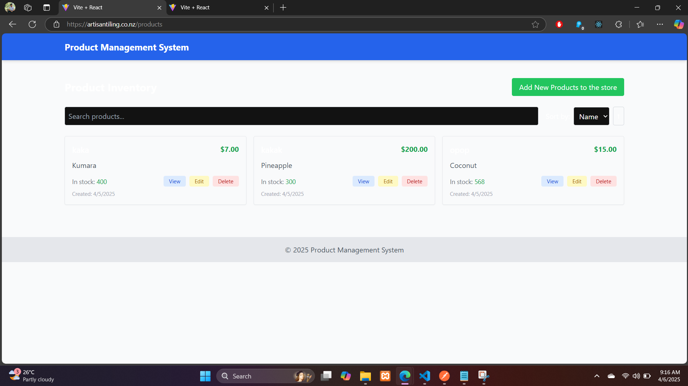

# 🚀 Product Management React + Vite Application

A modern product management application built with React and Vite.



## ✨ Features

- Fast product browsing and search
- Product category filtering
- Responsive design for all devices
- Admin dashboard for product management
- CRUD dashboard for product management

## 🛠️ Quick Setup

```bash
# Clone the repository
git clone https://github.com/CaringalML/Product-Management-React-JS.git

# Navigate to the project directory
cd Product-Management-React-JS

# Install dependencies
npm ci

# Start the development server
npm run dev
```

Visit `http://localhost:3000` to see the application running.

## 📦 Build for Production

```bash
# Create optimized production build
npm run build

# Preview the production build locally
npm run preview
```

The build output will be in the `dist` directory, ready to be deployed.

## 🔧 Environment Configuration

Create a `.env` file in the root directory:

```
VITE_API_BASE_URL=http://localhost/api
```

For production, update the URL to your actual API endpoint.

## 🚢 Deployment

This application is designed to work with the CloudStruct infrastructure.

For manual deployment:
```bash
aws s3 sync ./dist s3://caringalfrontend/frontend-build --delete
```

Or use the GitHub Actions workflow as described in the CloudStruct infrastructure README.

## 🏗️ Infrastructure Repository

The infrastructure code for deploying this application using AWS CloudFront and S3 is available at:
https://github.com/CaringalML/CloudStruct-A-Frontend-Infrastructure-with-AWS-CloudFront-and-S3.git

This repository contains the Terraform configuration for setting up the complete serverless infrastructure needed to host this application.

## 📚 Tech Stack

- React 18
- Vite
- React Router
- CSS Modules
- Axios for API requests
- TailwindCSS for styling
- ESLint for code quality

## 🤝 Contributing

1. Fork the repository
2. Create a feature branch
3. Submit a pull request

## 📄 License

This project is open-sourced under the MIT License.

## 👨‍💻 Author

Martin Caringal